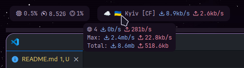

# Nekobar

A simple NekoBox status bar module for Waybar.



## Features

- Active profile name
- Tooltip
  - Connection count
  - Download speed
  - Upload speed
  - Max download speed
  - Max upload speed
  - Total download
  - Total upload

## Installation

1. Compile using `cargo build --release`, or download the binary from the [releases](https://github.com/MrYuto/nekobar/releases/latest) page.
2. Enable NekoBox Clash API from `Preferences > Basic Settings > Core > Core Options > Enable Clash API`.
3. Enable remember last profile from `Program > Remember last profile`

## Waybar config

```json
  "custom/nekobar": {
    "tooltip": true,
    "exec": "/path/to/nekobar",
    "return-type": "json",
  }
```

## Usage

```sh
Usage: nekobar [OPTIONS]

Options:
  -p, --port <PORT>          Clash API port [default: 9090]
  -i, --interval <INTERVAL>  Update interval in seconds [default: 1]
  -h, --help                 Print help
  -V, --version              Print version
```